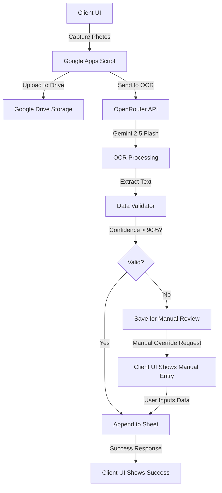

# OCR-Based Data Extraction Implementation Plan

## Overview
Transform the vehicle exit tracker from manual data entry to an OCR-powered system that automatically extracts vehicle plate numbers and invoice numbers from photos using OpenRouter's Gemini 2.5 Flash model.

## System Architecture



## Technical Specifications

### 1. Vehicle Plate Detection (Bangladesh Format)

**Expected Formats:**
- Dhaka Metro: `Dhaka Metro-XX-XXXX` (e.g., Dhaka Metro-14-5678)
- District format: `District-XX-XXXX` (e.g., Chittagong-15-1234)
- Private: `Private-XX-XXXX` (e.g., Private-25-7890)
- Motorcycle: `Motorcycle-XX-XXXX` (e.g., Motorcycle-30-4567)

**Regex Pattern:**
```javascript
const VEHICLE_PLATE_REGEX = /^(Dhaka Metro|Private|Motorcycle|[A-Za-z]+)-\d{2}-\d{4}$/;
```

**Validation Rules:**
- Must match Bangladesh plate format
- Confidence score > 90%
- Case-insensitive matching
- Allow hyphens and spaces variations

### 2. Invoice Number Detection

**Expected Format:**
- Pattern: `INV-DBBA/0325/3219`
- Structure: `INV-{4 letters}/{4 digits}/{4 digits}`

**Regex Pattern:**
```javascript
const INVOICE_REGEX = /^INV-[A-Z]{4}\/\d{4}\/\d{4}$/;
```

**Validation Rules:**
- Must start with "INV-"
- Followed by 4 uppercase letters
- Then 4 digits separated by "/"
- Then 4 more digits
- Confidence score > 90%

### 3. OCR Processing Flow

#### Step 1: Image Upload & Storage
```javascript
function processSubmission(data) {
  // 1. Upload vehicle plate photo
  const platePhotoUrl = uploadPhotoToDrive(data.platePhoto, `${data.submissionId}_plate`);
  
  // 2. Upload all invoice photos
  const invoicePhotoUrls = data.invoicePhotos.map((photo, index) => 
    uploadPhotoToDrive(photo, `${data.submissionId}_invoice_${index}`)
  );
  
  // 3. Process with OCR
  const ocrResults = processOCR(platePhotoUrl, invoicePhotoUrls);
  
  // 4. Validate and save
  return saveResults(ocrResults, data);
}
```

#### Step 2: OCR Service Integration
```javascript
function processOCR(platePhotoUrl, invoicePhotoUrls) {
  const results = {
    vehiclePlate: null,
    invoiceNumbers: [],
    confidence: 0,
    errors: []
  };
  
  // Process vehicle plate
  try {
    results.vehiclePlate = extractVehiclePlate(platePhotoUrl);
  } catch (error) {
    results.errors.push(`Plate OCR failed: ${error.message}`);
  }
  
  // Process each invoice
  for (let i = 0; i < invoicePhotoUrls.length; i++) {
    try {
      const invoice = extractInvoiceNumber(invoicePhotoUrls[i]);
      if (invoice) {
        results.invoiceNumbers.push(invoice);
      }
    } catch (error) {
      results.errors.push(`Invoice ${i+1} OCR failed: ${error.message}`);
    }
  }
  
  return results;
}
```

#### Step 3: OpenRouter API Integration
```javascript
function callOpenRouterOCR(imageUrl, prompt) {
  const apiKey = PropertiesService.getScriptProperties().getProperty('OPENROUTER_API_KEY');
  
  const payload = {
    model: 'google/gemini-2.5-flash',
    messages: [
      {
        role: 'user',
        content: [
          {
            type: 'text',
            text: prompt
          },
          {
            type: 'image_url',
            image_url: {
              url: imageUrl
            }
          }
        ]
      }
    ],
    max_tokens: 100,
    temperature: 0.1  // Low temperature for consistent results
  };
  
  const response = UrlFetchApp.fetch('https://openrouter.ai/api/v1/chat/completions', {
    method: 'POST',
    headers: {
      'Authorization': `Bearer ${apiKey}`,
      'Content-Type': 'application/json',
      'HTTP-Referer': ScriptApp.getService().getUrl(),
      'X-Title': 'Vehicle Exit Tracker'
    },
    payload: JSON.stringify(payload),
    muteHttpExceptions: true
  });
  
  if (response.getResponseCode() !== 200) {
    throw new Error(`OpenRouter API error: ${response.getContentText()}`);
  }
  
  return JSON.parse(response.getContentText());
}
```

#### Step 4: Vehicle Plate Extraction
```javascript
function extractVehiclePlate(imageUrl) {
  const prompt = `Extract the Bangladesh vehicle license plate number from this image.
  
Requirements:
- Return ONLY the plate number, nothing else
- Format: City/Type-XX-XXXX (e.g., Dhaka Metro-14-5678, Private-25-7890)
- Confidence: Rate your confidence from 0-100%
- If plate is not clearly visible, return "NOT_FOUND"

Return format:
{
  "plate": "extracted plate number",
  "confidence": 95
}`;

  const response = callOpenRouterOCR(imageUrl, prompt);
  const result = JSON.parse(response.choices[0].message.content);
  
  // Validate
  if (result.plate === 'NOT_FOUND') {
    throw new Error('Plate not clearly visible');
  }
  
  if (!VEHICLE_PLATE_REGEX.test(result.plate)) {
    throw new Error(`Invalid plate format: ${result.plate}`);
  }
  
  if (result.confidence < 90) {
    throw new Error(`Low confidence: ${result.confidence}%`);
  }
  
  return {
    number: result.plate,
    confidence: result.confidence,
    imageUrl: imageUrl
  };
}
```

#### Step 5: Invoice Number Extraction
```javascript
function extractInvoiceNumber(imageUrl) {
  const prompt = `Extract the invoice number from this image.
  
Requirements:
- Return ONLY the invoice number, nothing else
- Format: INV-XXXX/YYYY/ZZZZ (e.g., INV-DBBA/0325/3219)
- Must start with "INV-"
- Confidence: Rate your confidence from 0-100%
- If invoice number is not clearly visible, return "NOT_FOUND"

Return format:
{
  "invoice": "extracted invoice number",
  "confidence": 95
}`;

  const response = callOpenRouterOCR(imageUrl, prompt);
  const result = JSON.parse(response.choices[0].message.content);
  
  // Validate
  if (result.invoice === 'NOT_FOUND') {
    throw new Error('Invoice number not clearly visible');
  }
  
  if (!INVOICE_REGEX.test(result.invoice)) {
    throw new Error(`Invalid invoice format: ${result.invoice}`);
  }
  
  if (result.confidence < 90) {
    throw new Error(`Low confidence: ${result.confidence}%`);
  }
  
  return {
    number: result.invoice,
    confidence: result.confidence,
    imageUrl: imageUrl
  };
}
```

### 4. Data Validation & Confidence Scoring

#### Validation Function
```javascript
function validateOCRResults(results) {
  const validation = {
    isValid: true,
    requiresManualReview: false,
    issues: []
  };
  
  // Check vehicle plate
  if (!results.vehiclePlate) {
    validation.isValid = false;
    validation.requiresManualReview = true;
    validation.issues.push('Vehicle plate not detected or confidence < 90%');
  }
  
  // Check invoice numbers
  if (results.invoiceNumbers.length === 0) {
    validation.isValid = false;
    validation.requiresManualReview = true;
    validation.issues.push('No valid invoice numbers detected');
  }
  
  return validation;
}
```

### 5. Manual Override Mechanism

#### Server-Side: Save for Manual Review
```javascript
function saveForManualReview(data, ocrResults) {
  const sheet = SpreadsheetApp.getActiveSpreadsheet().getSheetByName('ManualReview');
  
  const rowData = [
    new Date().toISOString(),
    data.submissionId,
    JSON.stringify(ocrResults),
    data.location || 'N/A',
    data.deviceInfo || 'N/A',
    'PENDING_REVIEW',
    data.platePhotoUrl,
    data.invoicePhotoUrls.join(', ')
  ];
  
  sheet.appendRow(rowData);
  
  return {
    status: 'requires_manual_review',
    message: 'OCR processing completed but requires manual review',
    submissionId: data.submissionId
  };
}
```

#### Client-Side: Manual Entry UI
```html
<!-- Manual Override Modal -->
<div id="manualOverrideModal" class="modal hidden">
  <div class="modal-content">
    <h2>Manual Entry Required</h2>
    <p>OCR could not confidently extract the data. Please enter manually:</p>
    
    <div class="photo-preview">
      
    </div>
    
    <div class="form-group">
      <label>Vehicle Plate Number *</label>
      <input type="text" id="manualVehiclePlate" placeholder="e.g., Dhaka Metro-14-5678">
    </div>
    
    <div id="manualInvoiceInputs">
      <!-- Dynamic invoice inputs -->
    </div>
    
    <button id="submitManualEntry">Submit Manual Entry</button>
    <button id="cancelManualEntry">Cancel</button>
  </div>
</div>
```

### 6. Error Handling & Recovery

#### Error Categories
1. **OCR API Errors**: Network issues, rate limits, API failures
2. **Low Confidence**: Extracted data doesn't meet 90% threshold
3. **Invalid Format**: Extracted data doesn't match expected patterns
4. **Not Found**: Cannot locate text in image

#### Error Handling Strategy
```javascript
function handleOCRError(error, context) {
  const errorLog = {
    timestamp: new Date().toISOString(),
    errorType: error.name,
    errorMessage: error.message,
    context: context,
    submissionId: context.submissionId
  };
  
  // Log to error sheet
  logError(errorLog);
  
  // Return structured error response
  return {
    status: 'error',
    requiresManualReview: true,
    error: error.message,
    suggestion: getSuggestionForError(error.message)
  };
}

function getSuggestionForError(errorMessage) {
  if (errorMessage.includes('Low confidence')) {
    return 'Please retake the photo with better lighting and clearer focus';
  }
  if (errorMessage.includes('Invalid format')) {
    return 'Please ensure the plate/invoice is clearly visible and not obstructed';
  }
  if (errorMessage.includes('NOT_FOUND')) {
    return 'The plate or invoice number was not detected. Please retake the photo';
  }
  return 'Please try again or enter data manually';
}
```

### 7. Google Sheet Structure

#### Main Sheet (Sheet1)
| Timestamp | Photo URL | Vehicle Plate | Invoice Numbers | Location | Device Info | Capture Time | Submission ID | OCR Status |
|-----------|------------|---------------|-----------------|----------|-------------|--------------|---------------|-------------|
| 2024-01-13T... | https://... | Dhaka Metro-14-5678 | INV-DBBA/0325/3219 | 23.8103,90.4125 | iPhone 13 | 2024-01-13T... | abc-123 | SUCCESS |

#### Manual Review Sheet
| Timestamp | Submission ID | OCR Results | Location | Device Info | Status | Plate Photo URL | Invoice Photo URLs | Reviewed By | Review Date |
|-----------|---------------|--------------|----------|-------------|---------|----------------|-------------------|-------------|-------------|
| 2024-01-13T... | abc-123 | {...} | 23.8103,90.4125 | iPhone 13 | PENDING | https://... | https://...,https://... | - | - |

#### Error Log Sheet
| Timestamp | Error Type | Error Message | Context | Submission ID | Resolved |
|-----------|-------------|---------------|----------|---------------|-----------|
| 2024-01-13T... | LowConfidenceError | Confidence 85% | Plate extraction | abc-123 | false |

## Implementation Steps

### Phase 1: Backend (Google Apps Script)
1. ✅ Set up OpenRouter API key in script properties
2. ⬜ Implement OCR service functions
3. ⬜ Add regex validation for Bangladesh plates
4. ⬜ Add regex validation for invoice numbers
5. ⬜ Implement confidence scoring logic
6. ⬜ Create manual review sheet
7. ⬜ Update doPost function to handle OCR workflow
8. ⬜ Add error logging system

### Phase 2: Frontend (index.html)
1. ⬜ Remove manual input fields
2. ⬜ Add separate photo capture for vehicle plate
3. ⬜ Add photo capture for multiple invoices
4. ⬜ Implement manual override modal
5. ⬜ Update submission logic to send photos only
6. ⬜ Add loading states for OCR processing
7. ⬜ Display OCR results for confirmation
8. ⬜ Handle manual review responses

### Phase 3: Testing
1. ⬜ Test with various Bangladesh plate formats
2. ⬜ Test with invoice number variations
3. ⬜ Test low-confidence scenarios
4. ⬜ Test manual override flow
5. ⬜ Test error handling
6. ⬜ Performance testing with multiple invoices

### Phase 4: Documentation
1. ⬜ Update README with OCR workflow
2. ⬜ Create user guide for photo capture
3. ⬜ Document manual review process
4. ⬜ Update deployment guide

## Security Considerations

1. **API Key Storage**: Use PropertiesService, never hardcode
2. **Rate Limiting**: Implement exponential backoff for API calls
3. **Input Sanitization**: Validate all extracted data before storage
4. **Access Control**: Ensure Drive folder permissions are correct
5. **Error Messages**: Don't expose sensitive information in client responses

## Performance Optimization

1. **Parallel Processing**: Process multiple invoices concurrently
2. **Caching**: Cache OCR results for same images
3. **Image Optimization**: Compress images before OCR
4. **Timeout Handling**: Set appropriate timeouts for API calls
5. **Retry Logic**: Implement retry with backoff for transient errors

## Cost Estimation

**OpenRouter Pricing (Gemini 2.5 Flash):**
- Input: $0.075 per 1M tokens
- Output: $0.30 per 1M tokens
- Image tokens: ~1,000 tokens per image

**Estimated Cost per Submission:**
- 1 plate image: ~1,000 tokens input + ~100 tokens output
- 2 invoice images: ~2,000 tokens input + ~200 tokens output
- Total: ~3,300 tokens per submission
- Cost: ~$0.00025 per submission
- 1,000 submissions: ~$0.25

## Success Criteria

- ✅ OCR accuracy > 90% for clear images
- ✅ Processing time < 10 seconds per submission
- ✅ Manual override available for all failure scenarios
- ✅ All data validated before storage
- ✅ Complete audit trail for manual reviews
- ✅ User-friendly error messages
- ✅ Support for multiple invoice photos

## Risk Mitigation

1. **OCR Fails**: Manual override always available
2. **API Outage**: Save photos for batch processing later
3. **Rate Limits**: Implement queue system
4. **Cost Overrun**: Set monthly budget alerts
5. **Data Privacy**: Keep photos secure, limit access
