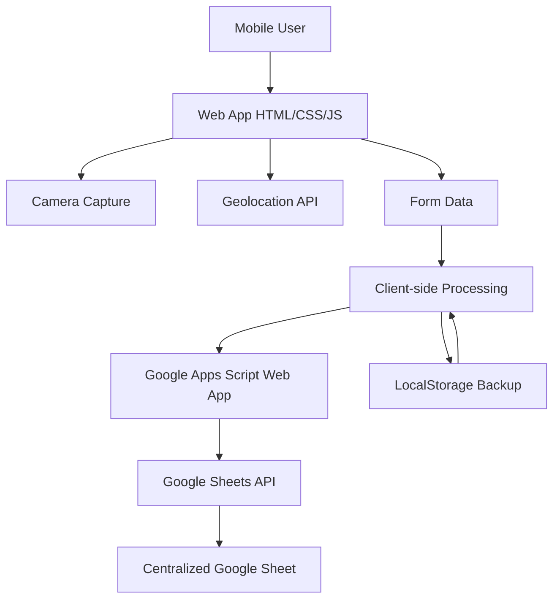

# Vehicle Exit Tracker - Implementation Plan

## Project Overview
A single-page mobile-first web application for factory workers to document vehicle exits with photo capture, vehicle number, and invoice numbers. Data is submitted to a centralized Google Sheet without using a database.

## Technology Stack
- **Frontend**: Pure HTML5, CSS3, JavaScript (ES6+)
- **Backend Integration**: Google Apps Script Web App
- **Data Storage**: Google Sheets
- **Camera Access**: Native HTML5 file input with capture attribute
- **Geolocation**: Browser Geolocation API
- **No frameworks**: Vanilla JavaScript only

---

## System Architecture



---

## Google Sheets Setup

### Step 1: Create Google Sheet
1. Go to [sheets.google.com](https://sheets.google.com)
2. Create a new spreadsheet named "Vehicle Exit Tracker"
3. Create the following columns in the first row (A1 through H1):

| Column | Header | Description |
|--------|--------|-------------|
| A | Timestamp | ISO 8601 format (e.g., 2026-01-13T10:30:00Z) |
| B | Photo URL | URL to uploaded photo in Google Drive |
| C | Vehicle Number | Alphanumeric vehicle identifier |
| D | Invoice Numbers | Comma-separated invoice numbers |
| E | Location | Latitude, Longitude (e.g., 23.8103, 90.4125) |
| F | Device Info | User agent string + screen resolution |
| G | Capture Time | Time when photo was taken |
| H | Submission ID | Unique UUID for each submission |

4. Format the sheet:
   - Set row 1 as bold header
   - Freeze row 1
   - Enable text wrapping for columns C and D
   - Set column widths appropriately

### Step 2: Create Google Drive Folder for Photos
1. Go to [drive.google.com](https://drive.google.com)
2. Create a folder named "Vehicle Exit Photos"
3. Note the folder ID from the URL (e.g., `1ABC...xyz`)
4. Share the folder with "Anyone with the link can view"

---

## Google Apps Script Setup

### Step 1: Open Apps Script Editor
1. In your Google Sheet, go to **Extensions** → **Apps Script**
2. This opens the Apps Script editor

### Step 2: Create the Web App Script
Create a new script file named `Code.gs` with the following code:

```javascript
// Configuration
const CONFIG = {
  FOLDER_ID: 'YOUR_DRIVE_FOLDER_ID', // Replace with actual folder ID
  SHEET_NAME: 'Sheet1'
};

// Web App Entry Point
function doPost(e) {
  const lock = LockService.getScriptLock();
  lock.tryLock(10000); // Wait up to 10 seconds for lock

  try {
    // Parse request data
    const data = JSON.parse(e.postData.contents);
    
    // Validate required fields
    if (!data.photoBase64 || !data.vehicleNumber || !data.invoiceNumbers) {
      return createResponse(400, 'Missing required fields');
    }

    // Upload photo to Drive
    const photoUrl = uploadPhotoToDrive(data.photoBase64, data.submissionId);
    
    // Append data to sheet
    appendToSheet({
      timestamp: new Date().toISOString(),
      photoUrl: photoUrl,
      vehicleNumber: data.vehicleNumber,
      invoiceNumbers: data.invoiceNumbers.join(', '),
      location: data.location || 'N/A',
      deviceInfo: data.deviceInfo || 'N/A',
      captureTime: data.captureTime || 'N/A',
      submissionId: data.submissionId
    });

    return createResponse(200, 'Submission successful', { photoUrl: photoUrl });

  } catch (error) {
    console.error('Error:', error);
    return createResponse(500, 'Internal server error: ' + error.message);
  } finally {
    lock.releaseLock();
  }
}

// Upload base64 photo to Google Drive
function uploadPhotoToDrive(base64Data, submissionId) {
  try {
    // Extract MIME type and data
    const matches = base64Data.match(/^data:(.+);base64,(.+)$/);
    const mimeType = matches[1];
    const data = Utilities.base64Decode(matches[2]);
    
    // Create blob
    const blob = Utilities.newBlob(data, mimeType, `vehicle_${submissionId}.jpg`);
    
    // Upload to Drive
    const folder = DriveApp.getFolderById(CONFIG.FOLDER_ID);
    const file = folder.createFile(blob);
    file.setSharing(DriveApp.Access.ANYONE_WITH_LINK, DriveApp.Permission.VIEW);
    
    return file.getUrl();
  } catch (error) {
    console.error('Photo upload error:', error);
    throw new Error('Failed to upload photo');
  }
}

// Append data to Google Sheet
function appendToSheet(data) {
  const sheet = SpreadsheetApp.getActiveSpreadsheet().getSheetByName(CONFIG.SHEET_NAME);
  
  const rowData = [
    data.timestamp,
    data.photoUrl,
    data.vehicleNumber,
    data.invoiceNumbers,
    data.location,
    data.deviceInfo,
    data.captureTime,
    data.submissionId
  ];
  
  sheet.appendRow(rowData);
}

// Create HTTP response
function createResponse(statusCode, message, data = {}) {
  return ContentService
    .createTextOutput(JSON.stringify({
      status: statusCode,
      message: message,
      data: data
    }))
    .setMimeType(ContentService.MimeType.JSON);
}

// CORS handling for OPTIONS requests
function doGet(e) {
  return ContentService
    .createTextOutput(JSON.stringify({
      status: 200,
      message: 'Vehicle Exit Tracker API is running'
    }))
    .setMimeType(ContentService.MimeType.JSON);
}
```

### Step 3: Deploy as Web App
1. Click **Deploy** → **New deployment**
2. Click the gear icon (⚙️) → **Web app**
3. Configure deployment:
   - **Description**: "Vehicle Exit Tracker v1"
   - **Execute as**: "Me" (your email)
   - **Who has access**: "Anyone" (critical for mobile users)
4. Click **Deploy**
5. **IMPORTANT**: Copy the Web App URL (e.g., `https://script.google.com/macros/s/ABC.../exec`)
6. Authorize the script when prompted (grant permissions for Drive and Sheets)

### Step 4: Test the Web App
Use curl or Postman to test:
```bash
curl -X POST "YOUR_WEB_APP_URL" \
  -H "Content-Type: application/json" \
  -d '{
    "photoBase64": "data:image/jpeg;base64,/9j/4AAQSkZJRg...",
    "vehicleNumber": "ABC123",
    "invoiceNumbers": ["INV001", "INV002"],
    "location": "23.8103, 90.4125",
    "deviceInfo": "Mozilla/5.0...",
    "captureTime": "2026-01-13T10:30:00Z",
    "submissionId": "550e8400-e29b-41d4-a716-446655440000"
  }'
```

---

## Frontend Implementation

### File Structure
```
vehicle_exit_tracker/
├── index.html          # Single page application
├── styles.css          # All styles (inline in HTML for deployment)
└── script.js           # All JavaScript logic
```

### HTML Structure (`index.html`)

```html
<!DOCTYPE html>
<html lang="en">
<head>
    <meta charset="UTF-8">
    <meta name="viewport" content="width=device-width, initial-scale=1.0, maximum-scale=1.0, user-scalable=no">
    <meta name="theme-color" content="#2563eb">
    <meta name="apple-mobile-web-app-capable" content="yes">
    <meta name="apple-mobile-web-app-status-bar-style" content="black-translucent">
    <title>Vehicle Exit Tracker</title>
    <style>
        /* CSS will be embedded here */
    </style>
</head>
<body>
    <div class="container">
        <!-- Camera Section (Initially Visible) -->
        <div id="cameraSection" class="camera-section">
            <div class="camera-icon-wrapper">
                <svg class="camera-icon" viewBox="0 0 24 24" fill="none" stroke="currentColor" stroke-width="2">
                    <path d="M23 19a2 2 0 0 1-2 2H3a2 2 0 0 1-2-2V8a2 2 0 0 1 2-2h4l2-3h6l2 3h4a2 2 0 0 1 2 2z"/>
                    <circle cx="12" cy="13" r="4"/>
                </svg>
            </div>
            <p class="camera-instruction">Tap to capture vehicle photo</p>
            <input type="file" id="cameraInput" accept="image/*" capture="environment" class="hidden">
        </div>

        <!-- Photo Preview Section (Hidden Initially) -->
        <div id="photoSection" class="photo-section hidden">
            <div class="photo-preview">
                
                <button id="retakeButton" class="retake-button" aria-label="Retake photo">
                    <svg viewBox="0 0 24 24" fill="none" stroke="currentColor" stroke-width="2">
                        <path d="M23 4v6h-6"/>
                        <path d="M20.49 15a9 9 0 1 1-2.12-9.36L23 10"/>
                    </svg>
                    Retake
                </button>
            </div>
        </div>

        <!-- Form Section (Hidden Initially) -->
        <div id="formSection" class="form-section hidden">
            <form id="submissionForm">
                <!-- Vehicle Number -->
                <div class="form-group">
                    <label for="vehicleNumber" class="form-label">Vehicle Number *</label>
                    <input 
                        type="text" 
                        id="vehicleNumber" 
                        name="vehicleNumber" 
                        class="form-input"
                        placeholder="e.g., ABC-1234"
                        required
                        autocomplete="off"
                        inputmode="text"
                        aria-required="true"
                    >
                </div>

                <!-- Invoice Numbers -->
                <div class="form-group">
                    <label class="form-label">Invoice Numbers *</label>
                    <div id="invoiceNumbersContainer" class="invoice-container">
                        <input 
                            type="text" 
                            name="invoiceNumber" 
                            class="form-input invoice-input"
                            placeholder="e.g., INV-001"
                            required
                            autocomplete="off"
                            inputmode="text"
                            aria-required="true"
                        >
                    </div>
                    <button type="button" id="addInvoiceButton" class="add-invoice-button">
                        <svg viewBox="0 0 24 24" fill="none" stroke="currentColor" stroke-width="2">
                            <line x1="12" y1="5" x2="12" y2="19"/>
                            <line x1="5" y1="12" x2="19" y2="12"/>
                        </svg>
                        Add Another Invoice
                    </button>
                </div>

                <!-- Location Info (Read-only) -->
                <div class="form-group">
                    <label class="form-label">Location</label>
                    <div id="locationInfo" class="location-info">
                        <span class="location-status">Acquiring location...</span>
                    </div>
                </div>

                <!-- Submit Button -->
                <button type="submit" id="submitBtn" class="submit-button">
                    <span class="button-text">Submit Entry</span>
                    <span class="button-loader hidden">
                        <svg class="spinner" viewBox="0 0 50 50">
                            <circle cx="25" cy="25" r="20" fill="none" stroke="currentColor" stroke-width="5"/>
                        </svg>
                    </span>
                </button>
            </form>
        </div>

        <!-- Success Message (Hidden Initially) -->
        <div id="successMessage" class="success-message hidden">
            <div class="success-icon">
                <svg viewBox="0 0 24 24" fill="none" stroke="currentColor" stroke-width="2">
                    <path d="M22 11.08V12a10 10 0 1 1-5.93-9.14"/>
                    <polyline points="22 4 12 14.01 9 11.01"/>
                </svg>
            </div>
            <h2 class="success-title">Entry Submitted!</h2>
            <p class="success-text">Your vehicle exit has been recorded.</p>
            <button id="newEntryButton" class="new-entry-button">Record Another Exit</button>
        </div>

        <!-- Error Message (Hidden Initially) -->
        <div id="errorMessage" class="error-message hidden">
            <div class="error-icon">
                <svg viewBox="0 0 24 24" fill="none" stroke="currentColor" stroke-width="2">
                    <circle cx="12" cy="12" r="10"/>
                    <line x1="12" y1="8" x2="12" y2="12"/>
                    <line x1="12" y1="16" x2="12.01" y2="16"/>
                </svg>
            </div>
            <h2 class="error-title">Submission Failed</h2>
            <p id="errorText" class="error-text">An error occurred. Please try again.</p>
            <button id="retryButton" class="retry-button">Retry</button>
        </div>
    </div>

    <script>
        /* JavaScript will be embedded here */
    </script>
</body>
</html>
```

### CSS Styles (Embedded in HTML)

```css
/* Reset & Base Styles */
* {
    margin: 0;
    padding: 0;
    box-sizing: border-box;
}

:root {
    --primary: #2563eb;
    --primary-dark: #1d4ed8;
    --success: #10b981;
    --error: #ef4444;
    --background: #f8fafc;
    --surface: #ffffff;
    --text-primary: #0f172a;
    --text-secondary: #64748b;
    --border: #e2e8f0;
    --shadow: 0 4px 6px -1px rgba(0, 0, 0, 0.1), 0 2px 4px -1px rgba(0, 0, 0, 0.06);
    --shadow-lg: 0 10px 15px -3px rgba(0, 0, 0, 0.1), 0 4px 6px -2px rgba(0, 0, 0, 0.05);
}

body {
    font-family: -apple-system, BlinkMacSystemFont, 'Segoe UI', Roboto, 'Helvetica Neue', Arial, sans-serif;
    background: var(--background);
    color: var(--text-primary);
    line-height: 1.5;
    min-height: 100vh;
    display: flex;
    align-items: center;
    justify-content: center;
    padding: 1rem;
}

.container {
    width: 100%;
    max-width: 480px;
    background: var(--surface);
    border-radius: 16px;
    box-shadow: var(--shadow-lg);
    overflow: hidden;
    min-height: 600px;
    display: flex;
    flex-direction: column;
}

/* Utility Classes */
.hidden {
    display: none !important;
}

/* Camera Section */
.camera-section {
    flex: 1;
    display: flex;
    flex-direction: column;
    align-items: center;
    justify-content: center;
    padding: 3rem 2rem;
    gap: 1.5rem;
}

.camera-icon-wrapper {
    width: 120px;
    height: 120px;
    background: linear-gradient(135deg, var(--primary), var(--primary-dark));
    border-radius: 50%;
    display: flex;
    align-items: center;
    justify-content: center;
    cursor: pointer;
    transition: transform 0.3s ease, box-shadow 0.3s ease;
    box-shadow: var(--shadow);
}

.camera-icon-wrapper:hover,
.camera-icon-wrapper:active {
    transform: scale(1.05);
    box-shadow: var(--shadow-lg);
}

.camera-icon {
    width: 60px;
    height: 60px;
    color: white;
}

.camera-instruction {
    font-size: 1.125rem;
    color: var(--text-secondary);
    text-align: center;
}

#cameraInput {
    display: none;
}

/* Photo Section */
.photo-section {
    padding: 1.5rem;
    background: var(--surface);
}

.photo-preview {
    position: relative;
    width: 100%;
    aspect-ratio: 4/3;
    border-radius: 12px;
    overflow: hidden;
    background: var(--border);
}

#photoPreview {
    width: 100%;
    height: 100%;
    object-fit: cover;
}

.retake-button {
    position: absolute;
    top: 1rem;
    right: 1rem;
    background: rgba(0, 0, 0, 0.7);
    color: white;
    border: none;
    border-radius: 8px;
    padding: 0.5rem 1rem;
    display: flex;
    align-items: center;
    gap: 0.5rem;
    font-size: 0.875rem;
    cursor: pointer;
    transition: background 0.2s ease;
    backdrop-filter: blur(4px);
}

.retake-button:hover {
    background: rgba(0, 0, 0, 0.85);
}

.retake-button svg {
    width: 16px;
    height: 16px;
}

/* Form Section */
.form-section {
    padding: 2rem 1.5rem;
    background: var(--surface);
}

.form-group {
    margin-bottom: 1.5rem;
}

.form-label {
    display: block;
    font-weight: 600;
    font-size: 0.875rem;
    color: var(--text-primary);
    margin-bottom: 0.5rem;
}

.form-input {
    width: 100%;
    padding: 0.875rem 1rem;
    font-size: 1rem;
    border: 2px solid var(--border);
    border-radius: 8px;
    background: var(--background);
    color: var(--text-primary);
    transition: border-color 0.2s ease, box-shadow 0.2s ease;
}

.form-input:focus {
    outline: none;
    border-color: var(--primary);
    box-shadow: 0 0 0 3px rgba(37, 99, 235, 0.1);
}

.form-input::placeholder {
    color: var(--text-secondary);
}

/* Invoice Numbers */
.invoice-container {
    display: flex;
    flex-direction: column;
    gap: 0.75rem;
}

.invoice-input {
    position: relative;
}

.invoice-input:not(:last-child)::after {
    content: '';
    position: absolute;
    right: 1rem;
    top: 50%;
    transform: translateY(-50%);
    width: 20px;
    height: 20px;
    background: var(--success);
    border-radius: 50%;
    display: flex;
    align-items: center;
    justify-content: center;
}

.invoice-input:not(:last-child)::after::before {
    content: '✓';
    color: white;
    font-size: 0.75rem;
}

.add-invoice-button {
    display: flex;
    align-items: center;
    justify-content: center;
    gap: 0.5rem;
    width: 100%;
    padding: 0.75rem;
    background: transparent;
    border: 2px dashed var(--border);
    border-radius: 8px;
    color: var(--primary);
    font-weight: 600;
    font-size: 0.875rem;
    cursor: pointer;
    transition: all 0.2s ease;
}

.add-invoice-button:hover {
    border-color: var(--primary);
    background: rgba(37, 99, 235, 0.05);
}

.add-invoice-button svg {
    width: 18px;
    height: 18px;
}

/* Location Info */
.location-info {
    padding: 0.75rem 1rem;
    background: var(--background);
    border-radius: 8px;
    font-size: 0.875rem;
    color: var(--text-secondary);
}

.location-status {
    display: flex;
    align-items: center;
    gap: 0.5rem;
}

.location-status::before {
    content: '';
    width: 8px;
    height: 8px;
    background: var(--primary);
    border-radius: 50%;
    animation: pulse 1.5s infinite;
}

@keyframes pulse {
    0%, 100% { opacity: 1; }
    50% { opacity: 0.5; }
}

/* Submit Button */
.submit-button {
    width: 100%;
    padding: 1rem;
    background: linear-gradient(135deg, var(--primary), var(--primary-dark));
    color: white;
    border: none;
    border-radius: 12px;
    font-size: 1rem;
    font-weight: 600;
    cursor: pointer;
    transition: transform 0.2s ease, box-shadow 0.2s ease;
    display: flex;
    align-items: center;
    justify-content: center;
    gap: 0.5rem;
    box-shadow: var(--shadow);
}

.submit-button:hover:not(:disabled) {
    transform: translateY(-2px);
    box-shadow: var(--shadow-lg);
}

.submit-button:active:not(:disabled) {
    transform: translateY(0);
}

.submit-button:disabled {
    opacity: 0.6;
    cursor: not-allowed;
}

.button-loader {
    display: flex;
    align-items: center;
}

.spinner {
    width: 20px;
    height: 20px;
    animation: spin 1s linear infinite;
}

.spinner circle {
    stroke-dasharray: 90, 150;
    stroke-dashoffset: 0;
    stroke-linecap: round;
    animation: dash 1.5s ease-in-out infinite;
}

@keyframes spin {
    100% { transform: rotate(360deg); }
}

@keyframes dash {
    0% { stroke-dasharray: 1, 150; stroke-dashoffset: 0; }
    50% { stroke-dasharray: 90, 150; stroke-dashoffset: -35; }
    100% { stroke-dasharray: 90, 150; stroke-dashoffset: -124; }
}

/* Success Message */
.success-message {
    flex: 1;
    display: flex;
    flex-direction: column;
    align-items: center;
    justify-content: center;
    padding: 3rem 2rem;
    text-align: center;
    gap: 1.5rem;
}

.success-icon {
    width: 80px;
    height: 80px;
    background: var(--success);
    border-radius: 50%;
    display: flex;
    align-items: center;
    justify-content: center;
    animation: scaleIn 0.5s ease;
}

.success-icon svg {
    width: 40px;
    height: 40px;
    color: white;
}

@keyframes scaleIn {
    0% { transform: scale(0); }
    50% { transform: scale(1.1); }
    100% { transform: scale(1); }
}

.success-title {
    font-size: 1.5rem;
    font-weight: 700;
    color: var(--text-primary);
}

.success-text {
    color: var(--text-secondary);
    font-size: 1rem;
}

.new-entry-button {
    padding: 1rem 2rem;
    background: var(--primary);
    color: white;
    border: none;
    border-radius: 12px;
    font-size: 1rem;
    font-weight: 600;
    cursor: pointer;
    transition: background 0.2s ease;
}

.new-entry-button:hover {
    background: var(--primary-dark);
}

/* Error Message */
.error-message {
    flex: 1;
    display: flex;
    flex-direction: column;
    align-items: center;
    justify-content: center;
    padding: 3rem 2rem;
    text-align: center;
    gap: 1.5rem;
}

.error-icon {
    width: 80px;
    height: 80px;
    background: var(--error);
    border-radius: 50%;
    display: flex;
    align-items: center;
    justify-content: center;
}

.error-icon svg {
    width: 40px;
    height: 40px;
    color: white;
}

.error-title {
    font-size: 1.5rem;
    font-weight: 700;
    color: var(--text-primary);
}

.error-text {
    color: var(--text-secondary);
    font-size: 1rem;
}

.retry-button {
    padding: 1rem 2rem;
    background: var(--error);
    color: white;
    border: none;
    border-radius: 12px;
    font-size: 1rem;
    font-weight: 600;
    cursor: pointer;
    transition: background 0.2s ease;
}

.retry-button:hover {
    background: #dc2626;
}

/* Responsive Design */
@media (max-width: 480px) {
    body {
        padding: 0;
    }

    .container {
        border-radius: 0;
        min-height: 100vh;
    }

    .camera-section {
        padding: 2rem 1.5rem;
    }

    .camera-icon-wrapper {
        width: 100px;
        height: 100px;
    }

    .camera-icon {
        width: 50px;
        height: 50px;
    }

    .form-section {
        padding: 1.5rem 1rem;
    }
}

/* Accessibility */
@media (prefers-reduced-motion: reduce) {
    * {
        animation-duration: 0.01ms !important;
        animation-iteration-count: 1 !important;
        transition-duration: 0.01ms !important;
    }
}

/* Focus styles for keyboard navigation */
*:focus-visible {
    outline: 3px solid var(--primary);
    outline-offset: 2px;
}
```

### JavaScript Logic (Embedded in HTML)

```javascript
// Configuration
const CONFIG = {
    WEB_APP_URL: 'YOUR_WEB_APP_URL_HERE', // Replace with actual URL
    MAX_PHOTO_SIZE: 1024 * 1024, // 1MB
    MAX_PHOTO_DIMENSION: 800,
    GEOLOCATION_TIMEOUT: 10000,
    GEOLOCATION_OPTIONS: {
        enableHighAccuracy: true,
        timeout: 10000,
        maximumAge: 0
    }
};

// State Management
const state = {
    photoData: null,
    photoCaptureTime: null,
    location: null,
    submissionId: null
};

// DOM Elements
const elements = {
    cameraSection: document.getElementById('cameraSection'),
    cameraInput: document.getElementById('cameraInput'),
    photoSection: document.getElementById('photoSection'),
    photoPreview: document.getElementById('photoPreview'),
    retakeButton: document.getElementById('retakeButton'),
    formSection: document.getElementById('formSection'),
    submissionForm: document.getElementById('submissionForm'),
    vehicleNumber: document.getElementById('vehicleNumber'),
    invoiceNumbersContainer: document.getElementById('invoiceNumbersContainer'),
    addInvoiceButton: document.getElementById('addInvoiceButton'),
    locationInfo: document.getElementById('locationInfo'),
    submitBtn: document.getElementById('submitBtn'),
    successMessage: document.getElementById('successMessage'),
    errorMessage: document.getElementById('errorMessage'),
    errorText: document.getElementById('errorText'),
    newEntryButton: document.getElementById('newEntryButton'),
    retryButton: document.getElementById('retryButton')
};

// Utility Functions
function generateUUID() {
    return 'xxxxxxxx-xxxx-4xxx-yxxx-xxxxxxxxxxxx'.replace(/[xy]/g, function(c) {
        const r = Math.random() * 16 | 0;
        const v = c === 'x' ? r : (r & 0x3 | 0x8);
        return v.toString(16);
    });
}

function getDeviceInfo() {
    return `${navigator.userAgent} | ${window.screen.width}x${window.screen.height}`;
}

function showElement(element) {
    element.classList.remove('hidden');
}

function hideElement(element) {
    element.classList.add('hidden');
}

function setLoading(loading) {
    const buttonText = elements.submitBtn.querySelector('.button-text');
    const buttonLoader = elements.submitBtn.querySelector('.button-loader');
    
    elements.submitBtn.disabled = loading;
    
    if (loading) {
        hideElement(buttonText);
        showElement(buttonLoader);
    } else {
        showElement(buttonText);
        hideElement(buttonLoader);
    }
}

// Camera Functions
function initCamera() {
    elements.cameraIconWrapper = document.querySelector('.camera-icon-wrapper');
    
    elements.cameraIconWrapper.addEventListener('click', () => {
        elements.cameraInput.click();
    });
    
    elements.cameraInput.addEventListener('change', handlePhotoCapture);
    elements.retakeButton.addEventListener('click', retakePhoto);
}

async function handlePhotoCapture(event) {
    const file = event.target.files[0];
    
    if (!file) return;
    
    try {
        // Validate file type
        if (!file.type.startsWith('image/')) {
            alert('Please select an image file');
            return;
        }
        
        // Compress photo
        const compressedData = await compressPhoto(file);
        
        // Update state
        state.photoData = compressedData;
        state.photoCaptureTime = new Date().toISOString();
        state.submissionId = generateUUID();
        
        // Show photo preview
        elements.photoPreview.src = compressedData;
        
        // Transition UI
        hideElement(elements.cameraSection);
        showElement(elements.photoSection);
        showElement(elements.formSection);
        
        // Start geolocation
        startGeolocation();
        
        // Focus on vehicle number input
        setTimeout(() => elements.vehicleNumber.focus(), 300);
        
    } catch (error) {
        console.error('Photo capture error:', error);
        alert('Failed to process photo. Please try again.');
    }
}

function retakePhoto() {
    // Reset state
    state.photoData = null;
    state.photoCaptureTime = null;
    state.location = null;
    
    // Reset form
    elements.submissionForm.reset();
    
    // Reset invoice inputs to single
    while (elements.invoiceNumbersContainer.children.length > 1) {
        elements.invoiceNumbersContainer.removeChild(elements.invoiceNumbersContainer.lastChild);
    }
    
    // Reset location display
    elements.locationInfo.innerHTML = '<span class="location-status">Acquiring location...</span>';
    
    // Reset camera input
    elements.cameraInput.value = '';
    
    // Transition UI back to camera
    hideElement(elements.photoSection);
    hideElement(elements.formSection);
    showElement(elements.cameraSection);
}

async function compressPhoto(file) {
    return new Promise((resolve, reject) => {
        const reader = new FileReader();
        
        reader.onload = (event) => {
            const img = new Image();
            
            img.onload = () => {
                const canvas = document.createElement('canvas');
                let width = img.width;
                let height = img.height;
                
                // Calculate dimensions
                if (width > height) {
                    if (width > CONFIG.MAX_PHOTO_DIMENSION) {
                        height = Math.round((height * CONFIG.MAX_PHOTO_DIMENSION) / width);
                        width = CONFIG.MAX_PHOTO_DIMENSION;
                    }
                } else {
                    if (height > CONFIG.MAX_PHOTO_DIMENSION) {
                        width = Math.round((width * CONFIG.MAX_PHOTO_DIMENSION) / height);
                        height = CONFIG.MAX_PHOTO_DIMENSION;
                    }
                }
                
                canvas.width = width;
                canvas.height = height;
                
                const ctx = canvas.getContext('2d');
                ctx.drawImage(img, 0, 0, width, height);
                
                // Compress to JPEG at 0.8 quality
                const compressedData = canvas.toDataURL('image/jpeg', 0.8);
                
                // Check size
                const sizeInBytes = Math.round((compressedData.length - 'data:image/jpeg;base64,'.length) * 3 / 4);
                
                if (sizeInBytes > CONFIG.MAX_PHOTO_SIZE) {
                    reject(new Error('Photo too large even after compression'));
                } else {
                    resolve(compressedData);
                }
            };
            
            img.onerror = () => reject(new Error('Failed to load image'));
            img.src = event.target.result;
        };
        
        reader.onerror = () => reject(new Error('Failed to read file'));
        reader.readAsDataURL(file);
    });
}

// Geolocation Functions
function startGeolocation() {
    if (!navigator.geolocation) {
        elements.locationInfo.innerHTML = '<span class="location-status">Location not supported</span>';
        return;
    }
    
    navigator.geolocation.getCurrentPosition(
        (position) => {
            state.location = `${position.coords.latitude.toFixed(6)}, ${position.coords.longitude.toFixed(6)}`;
            elements.locationInfo.innerHTML = `<span class="location-status" style="color: var(--success);">✓ ${state.location}</span>`;
        },
        (error) => {
            console.warn('Geolocation error:', error);
            let message = 'Location unavailable';
            
            switch (error.code) {
                case error.PERMISSION_DENIED:
                    message = 'Location permission denied';
                    break;
                case error.POSITION_UNAVAILABLE:
                    message = 'Position unavailable';
                    break;
                case error.TIMEOUT:
                    message = 'Location timeout';
                    break;
            }
            
            elements.locationInfo.innerHTML = `<span class="location-status" style="color: var(--error);">${message}</span>`;
        },
        CONFIG.GEOLOCATION_OPTIONS
    );
}

// Invoice Number Functions
function initInvoiceNumbers() {
    elements.addInvoiceButton.addEventListener('click', addInvoiceField);
    
    // Add remove button to existing invoice inputs
    addRemoveButton(elements.invoiceNumbersContainer.querySelector('.invoice-input'));
}

function addInvoiceField() {
    const input = document.createElement('input');
    input.type = 'text';
    input.name = 'invoiceNumber';
    input.className = 'form-input invoice-input';
    input.placeholder = 'e.g., INV-002';
    input.required = true;
    input.autocomplete = 'off';
    input.inputMode = 'text';
    input.setAttribute('aria-required', 'true');
    
    elements.invoiceNumbersContainer.appendChild(input);
    addRemoveButton(input);
    
    // Focus on new input
    setTimeout(() => input.focus(), 100);
}

function addRemoveButton(input) {
    if (elements.invoiceNumbersContainer.children.length === 1) {
        return; // Don't add remove button to first input
    }
    
    const removeButton = document.createElement('button');
    removeButton.type = 'button';
    removeButton.className = 'remove-invoice-button';
    removeButton.innerHTML = '×';
    removeButton.setAttribute('aria-label', 'Remove invoice number');
    
    removeButton.style.cssText = `
        position: absolute;
        right: 1rem;
        top: 50%;
        transform: translateY(-50%);
        width: 24px;
        height: 24px;
        background: var(--error);
        color: white;
        border: none;
        border-radius: 50%;
        font-size: 1.25rem;
        line-height: 1;
        cursor: pointer;
        display: flex;
        align-items: center;
        justify-content: center;
        transition: background 0.2s ease;
    `;
    
    removeButton.addEventListener('mouseenter', () => {
        removeButton.style.background = '#dc2626';
    });
    
    removeButton.addEventListener('mouseleave', () => {
        removeButton.style.background = 'var(--error)';
    });
    
    removeButton.addEventListener('click', () => {
        input.remove();
        
        // Update remove buttons on remaining inputs
        const inputs = elements.invoiceNumbersContainer.querySelectorAll('.invoice-input');
        inputs.forEach((inp, index) => {
            const existingButton = inp.parentElement.querySelector('.remove-invoice-button');
            if (existingButton) {
                existingButton.remove();
            }
            
            if (index > 0) {
                addRemoveButton(inp);
            }
        });
    });
    
    input.parentElement.style.position = 'relative';
    input.parentElement.appendChild(removeButton);
}

// Form Submission
function initForm() {
    elements.submissionForm.addEventListener('submit', handleSubmit);
    elements.newEntryButton.addEventListener('click', resetForm);
    elements.retryButton.addEventListener('click', () => {
        hideElement(elements.errorMessage);
        showElement(elements.formSection);
    });
}

async function handleSubmit(event) {
    event.preventDefault();
    
    // Validate
    if (!state.photoData) {
        alert('Please capture a photo first');
        return;
    }
    
    const vehicleNumber = elements.vehicleNumber.value.trim();
    const invoiceInputs = elements.invoiceNumbersContainer.querySelectorAll('input[name="invoiceNumber"]');
    const invoiceNumbers = Array.from(invoiceInputs)
        .map(input => input.value.trim())
        .filter(value => value.length > 0);
    
    if (!vehicleNumber) {
        alert('Please enter a vehicle number');
        elements.vehicleNumber.focus();
        return;
    }
    
    if (invoiceNumbers.length === 0) {
        alert('Please enter at least one invoice number');
        invoiceInputs[0].focus();
        return;
    }
    
    // Prepare data
    const submissionData = {
        photoBase64: state.photoData,
        vehicleNumber: vehicleNumber,
        invoiceNumbers: invoiceNumbers,
        location: state.location,
        deviceInfo: getDeviceInfo(),
        captureTime: state.photoCaptureTime,
        submissionId: state.submissionId
    };
    
    // Show loading
    setLoading(true);
    
    try {
        // Submit to Google Apps Script
        const response = await fetch(CONFIG.WEB_APP_URL, {
            method: 'POST',
            mode: 'no-cors', // Required for Google Apps Script
            headers: {
                'Content-Type': 'application/json',
            },
            body: JSON.stringify(submissionData)
        });
        
        // Store submission in localStorage for backup
        storeSubmission(submissionData);
        
        // Show success
        showSuccess();
        
    } catch (error) {
        console.error('Submission error:', error);
        showError(error.message);
    } finally {
        setLoading(false);
    }
}

function storeSubmission(data) {
    const submissions = JSON.parse(localStorage.getItem('vehicleExitSubmissions') || '[]');
    submissions.push({
        ...data,
        timestamp: new Date().toISOString(),
        synced: true
    });
    
    // Keep only last 50 submissions
    if (submissions.length > 50) {
        submissions.splice(0, submissions.length - 50);
    }
    
    localStorage.setItem('vehicleExitSubmissions', JSON.stringify(submissions));
}

function showSuccess() {
    hideElement(elements.formSection);
    hideElement(elements.photoSection);
    showElement(elements.successMessage);
}

function showError(message) {
    elements.errorText.textContent = message || 'An error occurred. Please try again.';
    hideElement(elements.formSection);
    showElement(elements.errorMessage);
}

function resetForm() {
    // Reset state
    state.photoData = null;
    state.photoCaptureTime = null;
    state.location = null;
    state.submissionId = null;
    
    // Reset form
    elements.submissionForm.reset();
    
    // Reset invoice inputs to single
    while (elements.invoiceNumbersContainer.children.length > 1) {
        elements.invoiceNumbersContainer.removeChild(elements.invoiceNumbersContainer.lastChild);
    }
    
    // Reset camera input
    elements.cameraInput.value = '';
    
    // Reset location display
    elements.locationInfo.innerHTML = '<span class="location-status">Acquiring location...</span>';
    
    // Hide messages
    hideElement(elements.successMessage);
    hideElement(elements.errorMessage);
    hideElement(elements.photoSection);
    hideElement(elements.formSection);
    
    // Show camera
    showElement(elements.cameraSection);
}

// Initialize
document.addEventListener('DOMContentLoaded', () => {
    initCamera();
    initInvoiceNumbers();
    initForm();
    
    // Check for unsynced submissions
    checkUnsyncedSubmissions();
});

function checkUnsyncedSubmissions() {
    const submissions = JSON.parse(localStorage.getItem('vehicleExitSubmissions') || '[]');
    const unsynced = submissions.filter(s => !s.synced);
    
    if (unsynced.length > 0) {
        console.log(`Found ${unsynced.length} unsynced submissions`);
        // You could implement auto-retry logic here
    }
}
```

---

## Deployment Instructions

### Step 1: Prepare the HTML File
1. Create a new file named `index.html`
2. Copy the HTML structure above
3. Replace `YOUR_WEB_APP_URL_HERE` in the JavaScript CONFIG with your actual Google Apps Script Web App URL
4. Save the file

### Step 2: Test Locally
1. Open `index.html` in a web browser
2. Test the camera capture (works on mobile devices)
3. Test form submission
4. Check Google Sheet for new entries

### Step 3: Deploy to Hosting
Choose one of the following hosting options:

#### Option A: GitHub Pages (Free)
1. Create a GitHub repository
2. Upload `index.html` to the repository
3. Go to repository **Settings** → **Pages**
4. Select **main** branch as source
5. Access at `https://yourusername.github.io/repository-name/`

#### Option B: Netlify (Free)
1. Go to [netlify.com](https://netlify.com)
2. Drag and drop the folder containing `index.html`
3. Get your URL instantly

#### Option C: Vercel (Free)
1. Go to [vercel.com](https://vercel.com)
2. Import your GitHub repository or upload files
3. Deploy with one click

#### Option D: Firebase Hosting (Free tier available)
1. Install Firebase CLI: `npm install -g firebase-tools`
2. Run `firebase login`
3. Run `firebase init` in your project directory
4. Select **Hosting**
5. Run `firebase deploy`

### Step 4: Mobile Testing
1. Deploy to hosting service
2. Open the URL on your mobile device
3. Test camera capture
4. Test form submission
5. Verify data appears in Google Sheet

---

## Testing Checklist

### Functional Testing
- [ ] Camera opens when icon is tapped
- [ ] Photo preview displays after capture
- [ ] Retake button works correctly
- [ ] Vehicle number input accepts alphanumeric characters
- [ ] Invoice number input accepts alphanumeric characters
- [ ] Add invoice button creates new input field
- [ ] Remove button deletes invoice input
- [ ] Location is captured (or shows appropriate error)
- [ ] Submit button sends data to Google Sheet
- [ ] Success message displays after submission
- [ ] New entry button resets form correctly

### Cross-Platform Testing
- [ ] Test on Android Chrome
- [ ] Test on iOS Safari
- [ ] Test on desktop Chrome
- [ ] Test on desktop Safari
- [ ] Test on desktop Firefox

### Edge Case Testing
- [ ] Camera permission denied
- [ ] Location permission denied
- [ ] Network offline during submission
- [ ] Very large photo file
- [ ] Multiple rapid submissions
- [ ] Invalid invoice number format
- [ ] Empty vehicle number

### Accessibility Testing
- [ ] All interactive elements are keyboard accessible
- [ ] Focus indicators are visible
- [ ] Screen reader announces elements correctly
- [ ] Color contrast meets WCAG AA standards
- [ ] Touch targets are at least 44x44px

---

## Security Considerations

1. **Google Apps Script Security**:
   - Deploy as "Me" (your account) to control access
   - Set "Who has access" to "Anyone" for public web app
   - Regularly review script permissions
   - Monitor script execution logs

2. **Data Privacy**:
   - No personal data is collected beyond device info
   - Location data is only captured with user permission
   - Photos are stored in Google Drive with view-only access
   - Consider adding data retention policy

3. **Input Validation**:
   - All inputs are sanitized before submission
   - Vehicle number and invoice numbers are validated as non-empty
   - File type validation for photos
   - Size limits for photos

4. **Rate Limiting**:
   - Google Apps Script has rate limits (1000 executions/day)
   - Consider implementing client-side debouncing
   - Monitor usage and upgrade if needed

---

## Maintenance & Monitoring

### Regular Tasks
1. **Weekly**:
   - Check Google Sheet for data quality
   - Review Google Drive storage usage
   - Monitor script execution logs

2. **Monthly**:
   - Review and clean up old photos if needed
   - Check for any script errors
   - Verify web app is still accessible

3. **Quarterly**:
   - Review and update Google Apps Script if needed
   - Test all functionality end-to-end
   - Consider adding new features based on feedback

### Monitoring
- Set up Google Drive storage alerts
- Monitor script execution quotas
- Track submission volume
- Review error logs in Apps Script

---

## Future Enhancements (Optional)

1. **Offline Support**:
   - Implement Service Worker for offline functionality
   - Queue submissions when offline
   - Sync when connection restored

2. **Advanced Features**:
   - Barcode/QR code scanning for invoice numbers
   - Voice input for vehicle numbers
   - Multi-language support
   - Dark mode toggle

3. **Analytics**:
   - Track submission frequency
   - Monitor peak usage times
   - Identify common errors

4. **Admin Dashboard**:
   - View all submissions
   - Export data to CSV
   - Search and filter entries
   - Generate reports

---

## Troubleshooting

### Common Issues

**Issue**: Camera not opening on mobile
- **Solution**: Ensure HTTPS is used (required for camera access on most browsers)

**Issue**: Photos not uploading to Google Drive
- **Solution**: Check FOLDER_ID in Apps Script CONFIG is correct

**Issue**: Form submission fails silently
- **Solution**: Check browser console for errors, verify Web App URL is correct

**Issue**: Location not captured
- **Solution**: Ensure location permission is granted, check device GPS settings

**Issue**: Google Apps Script quota exceeded
- **Solution**: Monitor usage, consider upgrading to Google Workspace or implementing caching

---

## Contact & Support

For issues or questions:
1. Check this documentation
2. Review Google Apps Script logs
3. Test with browser developer tools
4. Consult Google Apps Script documentation

---

## Appendix

### Google Apps Script Quotas
- **Executions**: 1,000/day (free tier)
- **Execution time**: 6 minutes/execution
- **Triggers**: 20/day
- **Email attachments**: 100/day

### Browser Compatibility
- **Chrome**: Full support
- **Safari**: Full support (iOS 11+)
- **Firefox**: Full support
- **Edge**: Full support
- **Opera**: Full support

### File Size Limits
- **Photo upload**: 10MB (Google Drive limit)
- **Recommended photo size**: < 1MB after compression
- **Base64 encoding**: Increases size by ~33%

---

**End of Implementation Plan**
